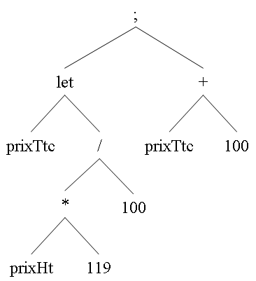

# TP Compilation : Génération d'arbres abstraits

L'objectif du TP est d'utiliser les outils JFlex et CUP pour générer des arbres abstraits correspondant à un sous ensemble du langage **λ-ada**.

## Exercice 1 :

Utiliser JFlex et CUP pour générer l'arbre abstrait correspondant à l'analyse d'expressions arithmétiques sur les nombres entiers.

Exemple de fichier source pour l'analyseur :

```
12 + 5;             /* ceci est un commentaire */
10 / 2 - 3;  99;    /* le point-virgule sépare les expressions à évaluer */
/* l'évaluation donne toujours un nombre entier */
((30 * 1) + 4) mod 2; /* opérateurs binaires */
3 * -4;             /* attention à l'opérateur unaire */

let prixHt = 200;   /* une variable prend valeur lors de sa déclaration */
let prixTtc =  prixHt * 119 / 100;
prixTtc + 100.
```

L'expression

```
let prixTtc =  prixHt * 119 / 100;
prixTtc + 100
```
pourra donner, par exemple, l'arbre suivant :



Une fois l'arbre généré, récupérez le dans le programme pricipal et affichez le, par exemple sous la forme d'une expression préfixée parenthésée :
`(; (LET prixTtc (/ (* prixHt 119) 100)) (+ prixTtc 100))`

## Exercice 2 :

Compléter la grammaire précédente en y ajoutant les opérateurs booléens, ceux de comparaison, la boucle et la conditionnelle, afin d'obtenir un sous-ensemble du langage **λ-ada** un peu plus complet.

Grammaire abstraite du sous-ensemble de λ-ada correspondant :

```
expression → expression ';' expression  
expression → LET IDENT '=' expression
expression → IF expression THEN expression ELSE expression
expression → WHILE expression DO expression
expression → '-' expression
expression → expression '+' expression
expression → expression '-' expression
expression → expression '*' expression
expression → expression '/' expression
expression → expression MOD expression
expression → expression '<' expression
expression → expression '<=' expression
expression → expression '=' expression
expression → expression AND expression
expression → expression OR expression
expression → NOT expression 
expression → OUTPUT expression 
expression → INPUT | NIL | IDENT | ENTIER
```

Le langage obtenu est tout de suite un peu plus intéressant et permet de programmer plus de choses.

Exemple de programme possible pour le sous-ensemble de λ-ada considéré ici : calcul de PGCD.

```
let a = input;
let b = input;
while (0 < b)
do (let aux=(a mod b); let a=b; let b=aux );
output a .
```

---

## Architecture et Fonctionnement de l'AST

Pour représenter la structure du code analysé, nous avons mis en place une hiérarchie de classes orientées objets en Java. Lors de l'analyse syntaxique, CUP instancie ces classes pour construire l'Arbre Syntaxique Abstrait (AST) de bas en haut.

Toutes les structures héritent d'une classe abstraite de base `Arbre` et se divisent en plusieurs types de nœuds :

* **Les Feuilles (Valeurs) :**
* `ArbreEntier` : Représente une constante numérique (ex: `12`).
* `ArbreIdent` : Représente une variable ou un mot-clé terminal sans opérande (ex: `prixHt`, `INPUT`, `NIL`).


* **Les Nœuds Internes (Opérations) :**
* `ArbreBinaire` : Gère les opérations à deux enfants (gauche et droit). Utilisé pour les maths (`+`, `-`, `*`), la logique (`AND`, `<`), mais aussi pour les séquences (`;`) et les boucles (`WHILE`).
* `ArbreUnaire` : Gère les opérations à un seul enfant. Utilisé pour les opérateurs unaires (`-` unaire, `NOT`) et les instructions simples (`OUTPUT`).
* `ArbreLet` : Nœud spécifique pour les affectations, stockant directement le nom de la variable (chaine de caractères) et le sous-arbre correspondant à sa valeur.


**Affichage :**
Chaque classe redéfinit la méthode `toString()` pour sérialiser l'arbre sous forme d'une expression préfixée parenthésée (style Lisp). La racine de l'arbre déclenche une cascade d'appels récursifs permettant d'afficher l'intégralité du programme sur une seule ligne.

---

## Compilation et Exécution

Pour compiler le projet sans lancer les tests (génération des sources JFlex et CUP incluse) :

```bash
./gradlew build -x test

```

Pour exécuter le programme généré sur un fichier de test :

```bash
java -jar build/libs/compilationTp3-4.jar .\fichier_test_exo_2.txt

```